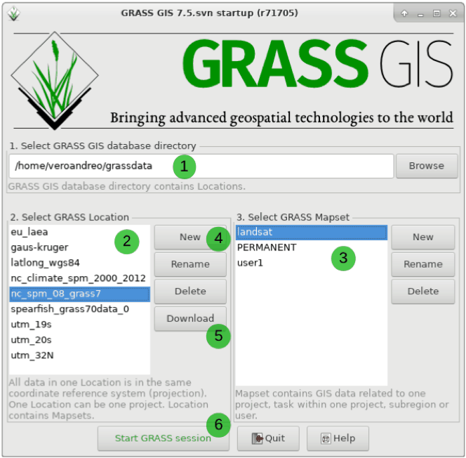
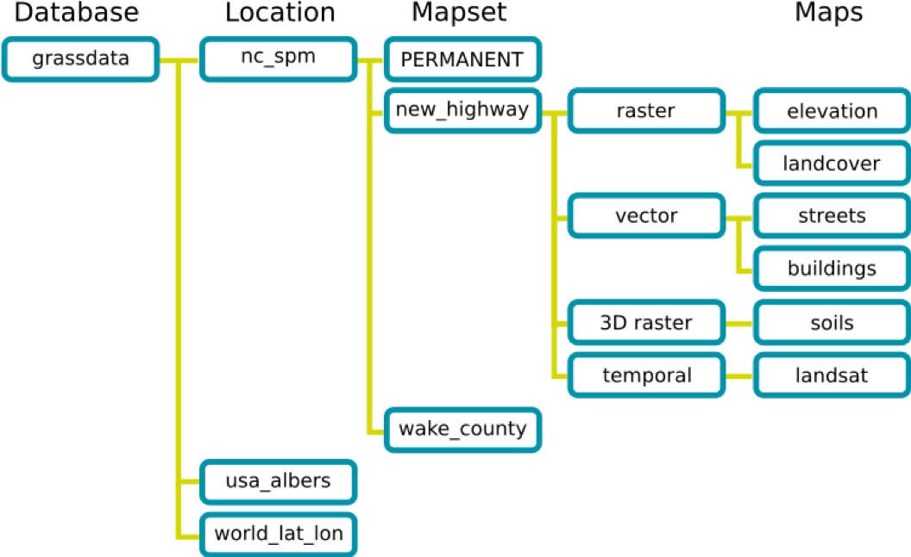

# GRASS GIS Python library

The Geographic Resource Analysis Support System (GRASS) is a free and open source geographic information system (GIS). It is a powerful tool for managing, analyzing, and visualizing geospatial data, supporting raster, vector, and 3D modeling functionalities.


### Key Features

- This cross platform GIS runs on Windows, Mac, and Linux. 
- Support for large datasets and high-resolution analysis
- Extensive scripting and automation capabilities
- Integration with other GIS tools and libraries like QGIS, GDAL, and R

---

## Install GRASS GIS

Download the latest stable release from the official site:

[https://grass.osgeo.org/download/](https://grass.osgeo.org/download/)

Choose the installer based on your operating system:
- Standalone installer for **Windows**
- `.dmg` or Homebrew package for **MacOS**
- `apt`, `dnf`, or `snap` installation for **Linux**

---

## Starting GRASS GIS

When GRASS GIS launches, you must select a:

1. **GISDBASE** (root project directory)
2. **Location** (defines projection and extent)
3. **Mapset** (stores individual data and settings)

> 📘 Read the [GRASS Quickstart Guide](https://grass.osgeo.org/grass-stable/manuals/helptext.html) to understand this setup better.

### GRASS GIS Startup Screen



---

### GRASS GIS Database Structure



| Component   | Description |
|-------------|-------------|
| `GISDBASE`  | Root folder where all GRASS GIS data is stored. |
| `LOCATION`  | Folder inside `GISDBASE` that defines a projection/CRS. All data in a LOCATION shares the same CRS. |
| `MAPSET`    | Subdirectory of a LOCATION for storing actual data and managing workflows. |
| `PERMANENT` | Special mapset holding region settings and the default CRS. |
| `WIND`      | File in each MAPSET that holds region resolution/extent. |

---


## Common GRASS GIS Commands

Here are some frequently used GRASS GIS commands useful for working with rasters, vectors, regions, and exporting data.

---

### Starting and Managing Sessions

```bash
# Create a new location from scratch
grass -c /mnt/mapdata/grassdata/new_location

# Start GRASS in an existing location/mapset
grass /path/to/mapset/location

# Create a new mapset inside an existing location
g.mapset -c mapset=test location=ipa_india

# Switch to a different mapset
g.mapset mapset=pcp_mean_monthly

# Add multiple mapsets to current search path
g.mapsets mapset=nrsc_lulc,ind_annual_data operation=add
```

---

### Map and Region Management

```bash
# Check raster resolution and extent
r.info -g pcpm_imd_2023_10

# List all rasters and vectors
g.list type=raster,vector

# List all rasters and export to file
g.list rast map=etg_etb_ind_monthly >> names.txt

# Set region to match a raster or vector map
g.region raster=your_raster_map
g.region vector=your_vector_map

# View current region settings
g.region -p
```

---

### Import Data

```bash
# Import a raster file (GeoTIFF, NetCDF, etc.)
r.import input=chirps_pcp.tif output=chirps_pcp

# Import a vector file (GeoJSON, Shapefile, etc.)
v.import input=IndiaBoundary.geojson output=india_boundary
```

---

### Raster & Vector Info

```bash
# View metadata of a raster or vector
r.info map=chirps_pcp
v.info map=india_boundary
```

---

### Raster Operations

```bash
# Map algebra
r.mapcalc expression="output_map = raster1 + raster2"

# Zonal statistics
r.univar map=raster_map zones=vector_zones_map

# Raster statistics summary
r.stats -a input=raster_map_name

# Merge rasters
r.patch input=map1,map2 output=merged_map

# Clip raster with current region
r.clip input=your_raster output=clipped_raster

# Resample raster
r.resample input=your_raster output=resampled_raster

# Apply raster mask
r.mask raster=mask_map

# Export raster to GeoTIFF
r.out.gdal input=raster_map output=/path/output.tif format=GTiff
```

---

### Vector Operations

```bash
# Buffer vector geometry
v.buffer input=your_vector output=buffered_vector distance=500

# Convert vector to raster
v.to.rast input=your_vector output=rasterized_vector use=cat

# Convert raster to vector
r.to.vect input=your_raster output=vector_map feature=area

# Merge vectors
v.patch input=vector1,vector2 output=merged_vector

# Export vector to Shapefile
v.out.ogr input=vector_map output=/path/output.shp format=ESRI_Shapefile
```

---

> Tip: Always verify the region and CRS settings (`g.region -p`) before running any spatial operation.


---


## 📚 Learn More

- [GRASS GIS Official Site](https://grass.osgeo.org/)
- [GRASS GIS Documentation](http://grass.osgeo.org/documentation/)
- [Python API for GRASS](https://grass.osgeo.org/grass-stable/manuals/libpython/index.html)
- [GRASS GIS Manuals](https://grass.osgeo.org/learn/manuals/)
- [GRASS GIS Tutorials](https://grass-tutorials.osgeo.org/)
- [Intro to GRASS GIS Workshop](https://ncsu-geoforall-lab.github.io/grass-intro-workshop/)


